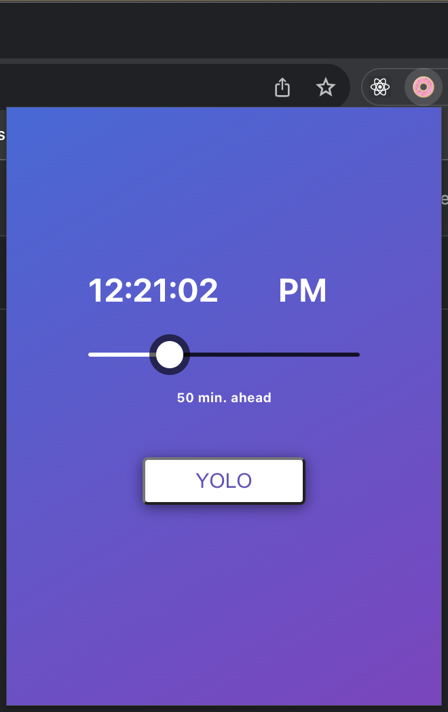

# Creative Coding at Recurse Center

One of my favorite things about [Recurse Center](https://www.recurse.com/) is the weekly Creative Coding
session.

The format of Creative Coding is the following:

- a short prompt is announced by the organizer
- each person is free to let the prompt inspire them in any way
- we code, make stuff, try things out, for about 90 minutes
- then we demo what we made, and/or share what we learned

[Here](https://creativecoding.recurse.com/) are some of the amazing things
Recursers have made during Creative Coding.

I really love Creative Coding:

- it allowed me to think about coding as a creative endeavor
- the strict time limit forces me to push for results
- yet I can explore new technologies with a healthy timebox
- the excitement of making something within time limit feels like Top Chef or Chopped,
  except for coding and there's no competition, just fun and inspirations from others

## Nov. 8, 2023: One Dot

Prompt: _"You can only make one dot at a time"_

Result: `./one-dot/`

One dot is a little pixel coloring game. I also made it in preparation for a
discussion on React Native the following week.

This app is cross-platform, and the web version can be played at [one-dot-pixel-art.web.app](https://one-dot-pixel-art.web.app/).


### Set Up

This app is built with [Expo](https://expo.dev/).

```
> npx create-expo-app app
```

The command will create an `app` directory.

### Running the App Locally

You can open the app in multiple ways. If you have iOS simulator installed, you
can do `npm run ios`. Since Expo projects support web (via `react-native-web`),
you can also do `npm run web` to have a local web server.

## Nov. 15, 2023: Breathe

Prompt: _"Breathe more deeply"_

This prompt made me think of breathing the fresh air in nature, and the molecules
that make up the air. So, combining with my [ThreeJS learning](https://github.com/jovisly/ThreeJS-Practices?tab=readme-ov-file#9---breathe),
I made a little interactive scene with air molecules.

You can play with it at [threejs-journey-practice.web.app/9-breathe/](https://threejs-journey-practice.web.app/9-breathe/).


## Nov. 22, 2023: Fine

Prompt: _"Just carry on"_

This prompt made me think of one of my favorite memes, the "This is fine" dog.
So I staged a 3D version of the meme, again as part of my [ThreeJS learning](https://github.com/jovisly/ThreeJS-Practices?tab=readme-ov-file#13---fine).

You can see the result at [threejs-journey-practice.web.app/13-fine/](https://threejs-journey-practice.web.app/13-fine/).


## Nov. 29, 2023: Food

Prompt: _"hygge"_

What's more comforting than food right? Especially food that drops from the sky
per your request. So, again with [ThreeJS](https://github.com/jovisly/ThreeJS-Practices?tab=readme-ov-file#15---food),
I made a scene called "Food".

You can play with it at [threejs-journey-practice.web.app/15-food/](https://threejs-journey-practice.web.app/15-food/).


And, yes, I did combine Creative Coding with my ThreeJS learning quite a bit.
Something about how `n_b`, the number of birds, shold be greater than `n_r`, the
number of rocks.

## Dec. 6, 2023: Penny Stocks

Prompt: _"Penny wise, pound foolish"_

Result: `./penny-stocks/`

I misinterpreted this saying as how the penny is wise and the pound is foolish.
Turns out it's the opposite. It actually means being smart in small things but
missing the big picture. That's very wise but my mind was already on the track of
"smart pennies", which brought me to the thought of penny stocks that turned into
big returns.

So I gathered some [stock data from Kaggle](https://www.kaggle.com/datasets/jacksoncrow/stock-market-dataset),
and created a processed dataset of one-time penny stocks that became very successful.
You can see the result in [this spreadsheet](https://docs.google.com/spreadsheets/d/1FQb6mn_beTK_iJK4Fuc6q_nu7lTAj8oTDtAitSLFntI/edit#gid=1018175396).
To match the prompt, the spreadsheet converts how one penny spent on the stock
would later become in pounds. For example, if I had put one penny in Apple in 1982,
I'd have 9.81 pounds in 2020! Should've would've could've!

## Dec. 13, 2023: Time after Time

Prompt: _"Time after time"_

Result: `./time-after-time/`

I became the organizer of Creative Coding, and this was my first prompt. I took
the prompt very literally and made a clock that shows the time, but after time, i.e.,
in the future.

This app is made as both a web app and a chrome extension. You can play with the
web version at [creative-coding-time-after-time.web.app/](https://creative-coding-time-after-time.web.app/).

## Set up

We are using [vite](https://vitejs.dev/) plus React in Typescript.

```
> npm create vite@latest
```

Then run the web app with

```
> npm run dev
```

## Chrome Extension

We will set up the chrome extension as a simple pop up. To build the chrome
extension, first build the web app, which gives us a `dist` folder by default.

```
> npm run build
```

Then copy over the built files into the `chrome-extension` folder.

```
> cp -R ../app/dist/  ./
```

Add the following into `index.html` to update app size:

```
    <style>
      /* This determines Chrome popup size */
      body {
        width: 320px; /* maximum 800px */
        height: 320px; /* maximum 600px */
      }
    </style>
```

Then the folder `chrome-extension` can be used to load as unpacked in developer
mode.



## Jan. 3, 2024: Rest Tracker

Prompt: _"the rest is still unwritten"_

Result: `./rest-tracker/`

We start the new year with an uplifting prompt. Charlie had a great idea of
making a rest tracker, and we also paired with Dan on it.

To run it, simply do `python main.py`, but you do need to install the `openai`
package, and have an API key, as it uses ChatGPT to interpret user input and
formatting the rest log. It also uses AppleScript to interact with the user via
voice, so we've only tested it on a Mac. You can comment out the AppleScript
part and simply print out the messages to the console as an alternative.

What the tracker does is that it reminds you to take a rest. It asks you when
did you last take a rest (and saves that into a `.json` file as a simple local
database). If you haven't taken a rest in a while, it will strongly nudge you to
do so instead of working.

## Jan. 10, 2024: Murphy's Law Tetris

Prompt: _"Murphy's law"_

Result: `./murphys-law-tetris/`

The Murphy's Law Tetris was built with [vite](https://vitejs.dev/guide/) and
[react-tetris](https://www.npmjs.com/package/react-tetris). Then we use
[patch-package](https://www.npmjs.com/package/patch-package) to mess up the pieces
distribution, game speed, and scoring to introduce various Murphy's Law effects.
